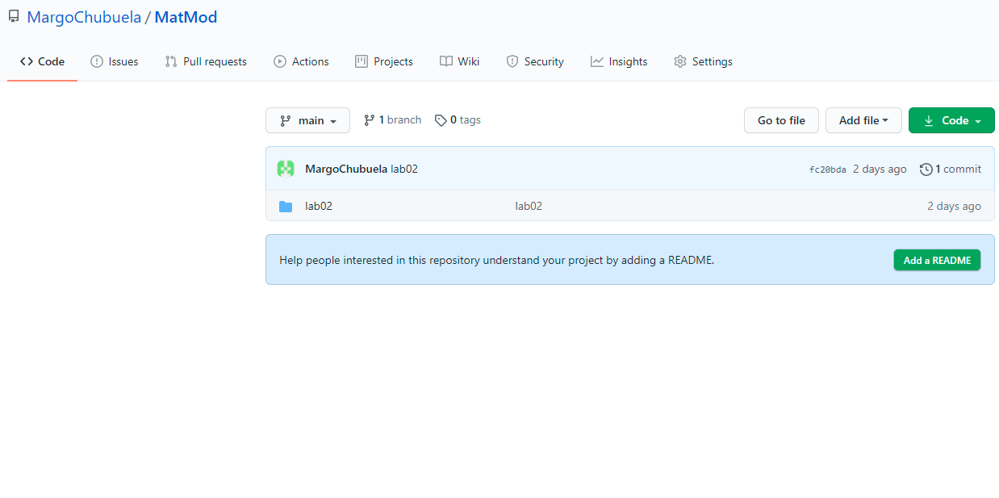
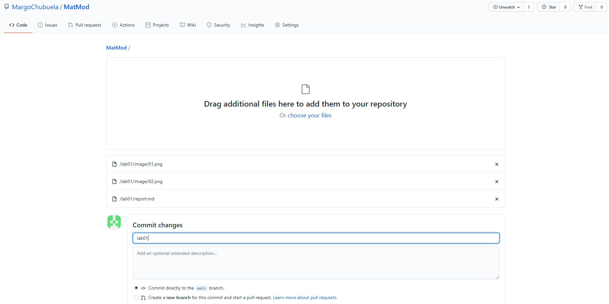
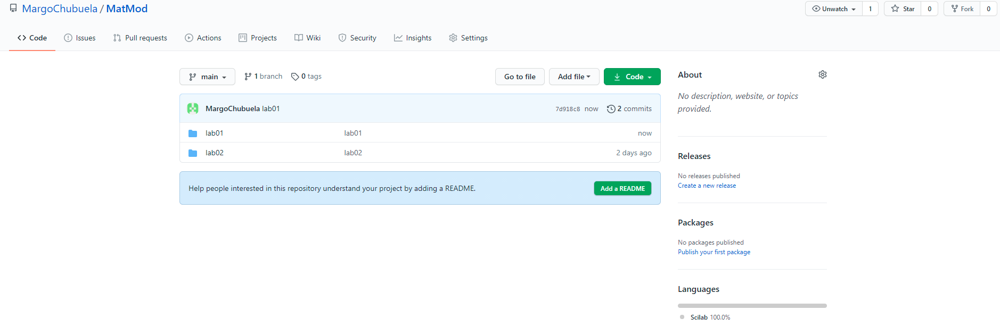

---
## Front matter
lang: ru-RU
title: Создание репозитория на GitHub
author: |
	 Чибуэла Маглуар Куэт НПИбд-02-18\inst{1}

institute: |
	\inst{1}Российский Университет Дружбы Народов

date: МатМод--2021, 12 февраля, 2021, Москва, Россия

## Formatting
mainfont: PT Serif
romanfont: PT Serif
sansfont: PT Sans
monofont: PT Mono
toc: false
slide_level: 2
theme: metropolis
header-includes: 
 - \metroset{progressbar=frametitle,sectionpage=progressbar,numbering=fraction}
 - '\makeatletter'
 - '\beamer@ignorenonframefalse'
 - '\makeatother'
aspectratio: 43
section-titles: true

---

# Цели и задачи работы

## Цель лабораторной работы

Ознакомиться с Git, создать репозиторий для хранения лабораторных работ

## Задание к лабораторной работе

1. Установить Git
2. Создать аккаунт на GitHub
3. Создать репозиторий для хранения лабораторных работ

# Процесс выполнения лабораторной работы

## Создание репозитория
Сначала я установила Git
Создала аккаунт на GitHub
 
{ #fig:001 width=70% }

## Загрузка файлов
Загрузила файлы на GitHub

{ #fig:002 width=70% }

{ #fig:003 width=70% }

## Репозиторий готов

{ #fig:004 width=70% }

# Выводы по проделанной работе

## Вывод

Создан репозиторий для хранения лабораторных работ на GitHub
